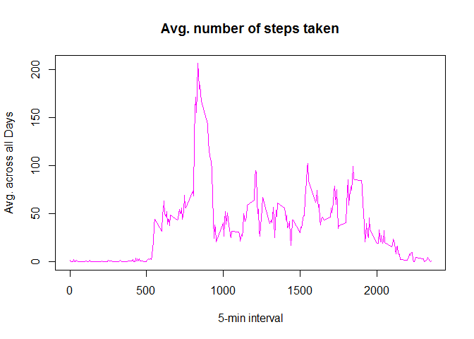
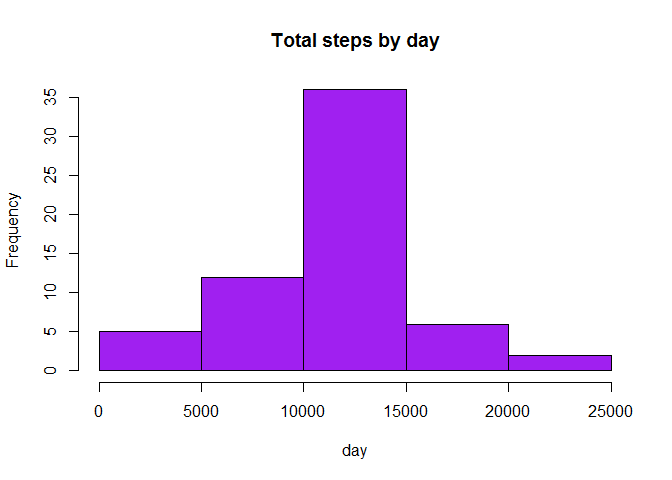

# Reproducible Research: Peer Assessment 1

## Loading and preprocessing the data
    ###In this preprocessing step, working directory was set, data was unzipped and lattice package 
    is being utilized

```r
getwd()
```

```
## [1] "C:/Users/Suresh/RepData_PeerAssessment1"
```

```r
setwd("C:/Users/Suresh/RepData_PeerAssessment1")
activity <- read.csv("activity.csv", colClasses = c("numeric", "character", "numeric"))
head(activity)
```

```
##   steps       date interval
## 1    NA 2012-10-01        0
## 2    NA 2012-10-01        5
## 3    NA 2012-10-01       10
## 4    NA 2012-10-01       15
## 5    NA 2012-10-01       20
## 6    NA 2012-10-01       25
```

```r
names(activity)
```

```
## [1] "steps"    "date"     "interval"
```

```r
library(lattice)
activity$date <- as.Date(activity$date, "%Y-%m-%d")
```


## What is mean total number of steps taken per day?
### Using the Aggregate function, the histogram DO NOT take dates into consideration that don't have data
    

```r
StepsTotal <- aggregate(steps ~ date, data = activity, sum, na.rm = TRUE)
hist(StepsTotal$steps, main = "Total steps by day", xlab = "day", col = "green")
```

 

```r
### Mean
mean(StepsTotal$steps)
```

```
## [1] 10766.19
```

```r
### Median
median(StepsTotal$steps)
```

```
## [1] 10765
```


## What is the average daily activity pattern?
    ### A time series plot (i.e. type = "l") of the 5-minute interval (x-axis) and the 
        avg. number of steps taken, avgd. across all days (y-axis)


```r
time_series <- tapply(activity$steps, activity$interval, mean, na.rm = TRUE)
plot(row.names(time_series), time_series, type = "l", xlab = "5-min interval", 
     ylab = "Avg. across all Days", main = "Avg. number of steps taken", 
     col = "magenta")
```

 

```r
### Which 5-minute interval, on average across all the days in the dataset, contains the maximum number of steps?
max_interval <- which.max(time_series)
names(max_interval)
```

```
## [1] "835"
```


## Imputing missing values

```r
### Calculate and report the total number of missing values in the dataset (i.e. the total number of rows      with NAs)
activity_NA <- sum(is.na(activity))
activity_NA
```

```
## [1] 2304
```

```r
### Devise a strategy for filling in all of the missing values in the dataset. The strategy does not need to be sophisticated. For example, you could use the mean/median for that day, or the mean for that 5-minute interval,etc
### Fist Na replaced by mean in 5 min interval

StepsAverage <- aggregate(steps ~ interval, data = activity, FUN = mean)
fillNA <- numeric()
    for (i in 1:nrow(activity))
        {
    obs <- activity[i, ]
    if (is.na(obs$steps)) {
        steps <- subset(StepsAverage, interval == obs$interval)$steps
        } 
    else 
    {
        steps <- obs$steps
    }
    fillNA <- c(fillNA, steps)
        }

### Create a new dataset that is equal to the original dataset but with the missing data filled in
new_activity <- activity
new_activity$steps <- fillNA

### Make a histogram of the total number of steps taken each day and Calculate and report the mean and median total number of steps taken per day. Do these values differ from the estimates from the first part of the assignment? What is the impact of imputing missing data on the estimates of the total daily number of steps?

StepsTotal2 <- aggregate(steps ~ date, data = new_activity, sum, na.rm = TRUE)

### Histogram 

hist(StepsTotal2$steps, main = "Total steps by day", xlab = "day", col = "purple")
```

 

```r
### Calculating Mean
    mean(StepsTotal2$steps)
```

```
## [1] 10766.19
```

```r
### Calculating the Median
    median(StepsTotal2$steps)
```

```
## [1] 10766.19
```

```r
### When compared to the question 2 answers, mean is almost the same and the median values are slightly varied
```


## Are there differences in activity patterns between weekdays and weekends?
    ### For this part the weekdays() function may be of some help here. 
           -Use the dataset with the filled-in missing values for this part. 
            Create a new factor variable in the dataset with two levels – “weekday” and “week
            end” indicating whether a given date is a weekday or weekend day.

```r
day <- weekdays(activity$date)
daylevel <- vector()
for (i in 1:nrow(activity)) {
    if (day[i] == "Saturday") {
        daylevel[i] <- "Weekend"
    } else if (day[i] == "Sunday") {
        daylevel[i] <- "Weekend"
    } else {
        daylevel[i] <- "Weekday"
    }
}
activity$daylevel <- daylevel
activity$daylevel <- factor(activity$daylevel)

stepsByDay <- aggregate(steps ~ interval + daylevel, data = activity, mean)
names(stepsByDay) <- c("interval", "daylevel", "steps")

### Make a panel plot containing a time series plot (i.e. type = "l") of the 5-minute interval (x-axis) and the average number of steps taken, averaged across all weekday days or weekend days (y-axis). The plot should look something like the following, which was creating using simulated data:

xyplot(steps ~ interval | daylevel, stepsByDay, type = "l", layout = c(1, 2), 
       xlab = "Interval", ylab = "Number of steps")
```

 
